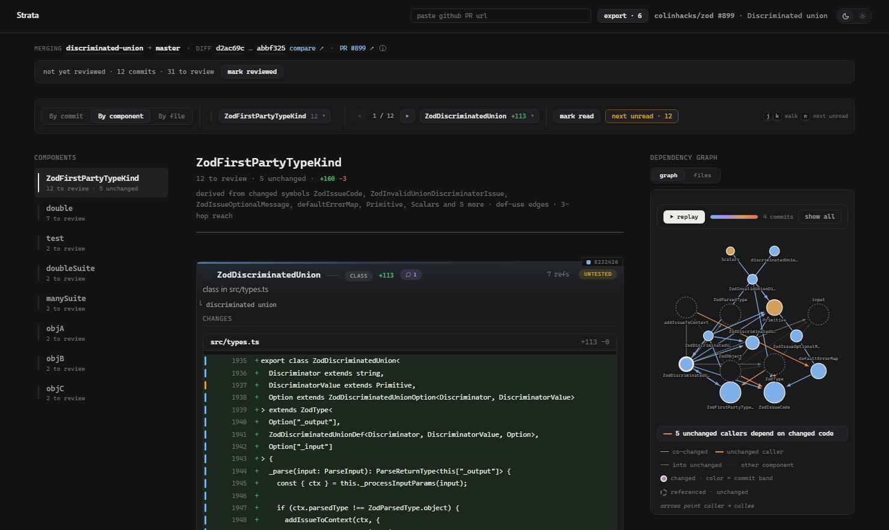
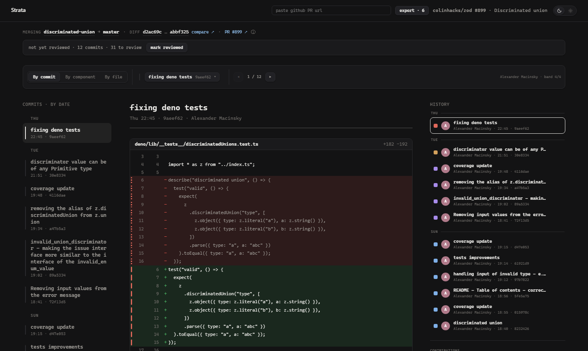
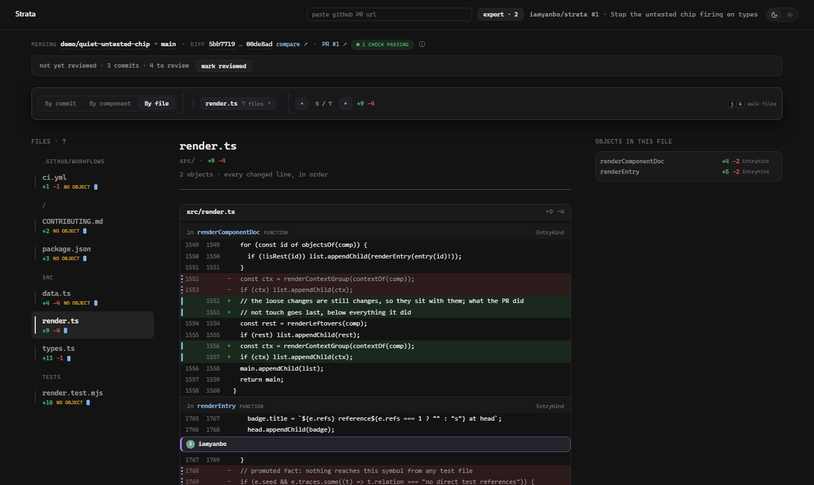
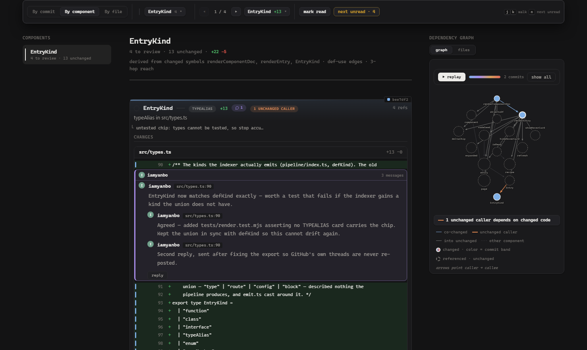

# Strata

**Read a pull request the way it was written.** Paste a GitHub PR url and Strata
rebuilds the change from its commits: who wrote each line and when, which symbols
actually changed, and what still depends on them. It runs on your machine.



Everything on screen is computed from git history and the TypeScript AST by
deterministic code. No LLM writes a word of what you see.

## Setup

You need **Node 22.22.2+** and **git**. Nothing else — no database, no account,
and no API key for reading public PRs.

```sh
git clone https://github.com/iamyanbo/strata
cd strata
npm install
npx tsc                # build the viewer + pipeline into dist/
node scripts/serve.mjs # → http://localhost:4517
```

Then paste any **merged** PR url into the bar at the top — or from a terminal:

```sh
node scripts/analyze.mjs https://github.com/owner/repo/pull/123
```

The first analysis of a repo shallow-fetches just the commits around that PR
into `repos/`, then writes one file, `data/pr-owner-repo-123.json`. The viewer
reads only that file. Re-paste the url any time to take a fresh snapshot; your
notes and read marks survive it.

To push review comments back to GitHub, export needs write access:

```sh
GITHUB_TOKEN=$(gh auth token) node scripts/serve.mjs
```

The token stays in the local server process. Reading works without one (GitHub
allows 60 requests an hour unauthenticated; a token raises that).

## Three lenses over one PR

Same data, three ways in. The switch is in the sticky bar, and `j` / `k` walk
whichever lens you are in.

### By component — what changed, and what it touches

Changed symbols seed a flood fill over a def−use index built from both trees;
what the fill reaches becomes a unit you read top to bottom. Each object shows
only the lines inside its own span, so six symbols in one edited file give you
six different diffs rather than six copies of the file.

The graph beside it is directed — arrows point caller → callee — and colored by
where the change sits: both ends changed, changed code reaching into stable
code, or an **unchanged caller depending on changed code**, which is the shape
most breakage takes. That last one is counted and filterable in one click.

### By commit — when it changed, and by whom



Every line carries a tick colored by the *sweep* that wrote it — a burst of work
separated by a calendar day or a two-hour gap. Blue is the careful first draft;
red is the pass bolted on an hour before opening. Deletions carry it too: blame
cannot see a removed line, so the commit that removed it is matched from that
commit's own diff.

### By file — the completeness backstop



The component lens is a lens: on a real PR it reaches about half the changed
lines, because docs, config and untyped sources declare no symbols. The file
lens lists every changed file in line order, labels each run of lines with the
object that owns it, and says plainly when nothing does.

## Reviewing



- **Write notes here.** Hover any diff line and `+` opens a composer. Notes are
  kept per PR in your browser until you push them. A note on a *removed* line
  anchors to the old file, so it lands on the left side of the GitHub diff.
- **Reply in the thread.** The PR's existing conversations come back with it,
  and your reply posts into the thread it answers — GitHub's reply endpoint, not
  a new comment floating beside it.
- **Export once.** Your notes leave as a single review. Anything already pushed
  is skipped on re-export, and the PR's own threads are shown for context but
  never re-sent.
- **Checkpoints that age.** *Mark reviewed* drops a checkpoint and ticks off
  every changed object. On the next push, only the objects those commits touched
  come back to unread — `11/11` becomes `5/11`, and the strip says which commits
  did it. Force-pushes are detected and handled.
- **Threads age too.** A comment survives a force-push via its line anchor, and
  if its line was rewritten afterwards the thread flags "rewritten since" with a
  before/after of what changed.

Objects the PR did not change are not mixed in with the ones it did: they wait
at the end behind one collapsed row, *unchanged references*, each saying what
reached it. They take no read tick and no place in the counter — you cannot
review what the PR did not change.

## Details worth knowing

- **A dataset is a photograph.** The head commit's CI is shown in the title
  line, stamped with the time it was read rather than pretended to be live.
- **A symbol owns only its own lines** — declaration, body, and the doc comment
  *attached* to it. A `////////` rule, or a comment separated by a blank line,
  belongs to no symbol. Changes made only of blank lines are not changes.
- **Whatever belongs to no symbol** — imports, top-level statements, test
  bodies — is collected into one card at the end of the component and reviewed
  like any other change.
- **Every call site is quotable.** Each object lists its callers and its calls
  with the source line verbatim, and unchanged callers open in place, labeled as
  unchanged, rather than being dressed up as part of the diff.

## Limits

- The indexer reads **TypeScript/JavaScript** only. PRs touching other languages
  still load; their symbols are not analyzed.
- Analyzes **merged** PRs — it needs a merge commit to define the window.
- Sweep detection uses a two-hour gap heuristic (`STRATA_SWEEP_GAP_HOURS`), and
  blame needs the writing commit inside the shallow-fetch window
  (`STRATA_FETCH_DEPTH` widens it).
- One local user: checkpoints and notes live in your browser's localStorage.
  This is a review *workbench*, not a hosted review system.

## Development

```sh
npx tsc --watch      # rebuild on change
npm test             # pipeline units, dataset invariants, the viewer in jsdom
npm run check        # type-check, then the tests
```

[ARCHITECTURE.md](ARCHITECTURE.md) walks the pipeline stages and the viewer's
modules. [CONTRIBUTING.md](CONTRIBUTING.md) has the ground rules — the main one
being that every signal on screen must be computable and traceable to a commit.

MIT licensed.
